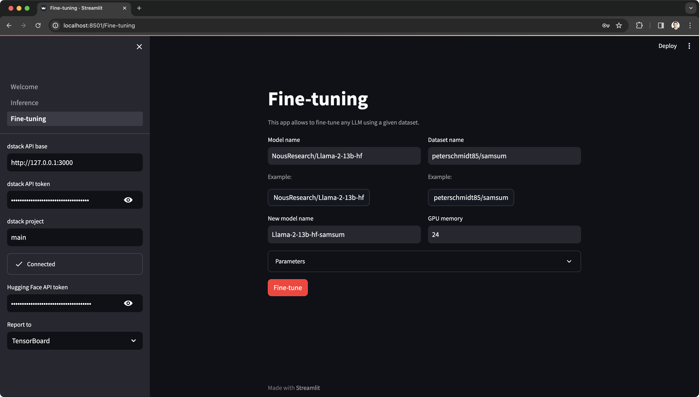

# LLM Weaver

This Streamlit app helps fine-tune and deploy LLMs using your cloud (AWS, GCP, Azure, Lambda Cloud, TensorDock, etc.) via user interface and access them for inference.



To run workloads in the cloud, the app uses [`dstack`](https://github.com/dstackai/dstack).
For inference, workloads use [`text-generation-inference`](https://github.com/huggingface/text-generation-inference).

## Get started

### 1. Install requirements

```shell
pip install -r requirements.txt
```

### 2. Set up the `dstack` server

> If you have default AWS, GCP, or Azure credentials on your machine, the dstack server will pick them up automatically.

Otherwise, you need to manually specify the cloud credentials in `~/.dstack/server/config.yml`. For further details, refer to [server configuration](https://dstack.ai/docs/configuration/server/).

Once clouds are configured, start it:

```shell
dstack server
```

Now you're good to run the app.


### 3. Run the app

```shell
streamlit run Welcome.py
```

